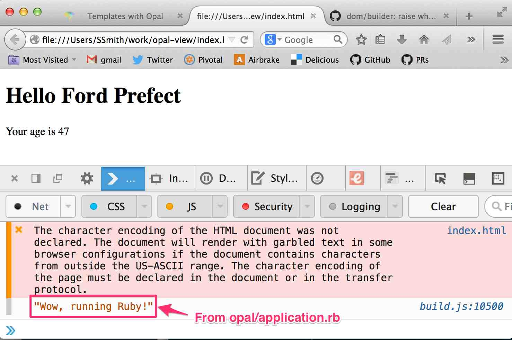

# Experimenting w/ Javascript in Opal

This is to support a [spiking activity](https://www.pivotaltracker.com/story/show/77776990)
in Opal.

# Summary

This is an [Opal](opalrb.org) [static installation](http://opalrb.org/docs/static_applications/)
that is set up for you.  This is useful for playing around w/ simple Opal/Javascript experiments.

# Installation

## Prerequisites

1.  Only tested in OSX (Mavericks)

## Recipe

1.  Run terminal commands:

```bash
    cd <your projects directory>
    git clone https://github.com/oldfartdeveloper/opal-view
    cd opal-view
    bundle
    bundle exec guard
```

2.  Set up auto-reload in Firefox:

    1. In Firefox, add the [autoreload addon for Firefox](https://addons.mozilla.org/en-us/firefox/addon/auto-reload/).
    1. Configure the addon in Firefox by:
         1.  Selecting `Tools` => `AutoReload Preferences`.
         1.  Editing the result pane as follows (adjust paths for your own system):
             

## Guard Implmentation

It's a pain to change client side code and have to manually reassemble the assets and reload
the page in the browser, so this has already been set up for you:

The automatic asset compilation has been implemented in `Guardfile`.
This rebuilds `build.js` whenever relevant files change.

## Installation Verification

1.  After doing the above, browse the `index.html` file as a file open.  Example URL:

    ```
    file:///Users/SSmith/work/opal-view/index.html
    ```
    
1.  In the browser pane, right click and select `Inspect Element`.
1.  Select `Console` tab in the inspector.
1.  Observe the following:
    

# FAQ

## Isn't this gonna be painful when you get too many development files?

You mean pain as in?

* Takes too long to generate `build.js`.
* Too much refresh; don't want to refresh *every* file change.

Answer is 'yes'; when it gets too painful, use Opal server.

## What is Opal Server?

*TODO*
